# Second Term Project: Building a cute whimsical Cyberdeck

<div align="center">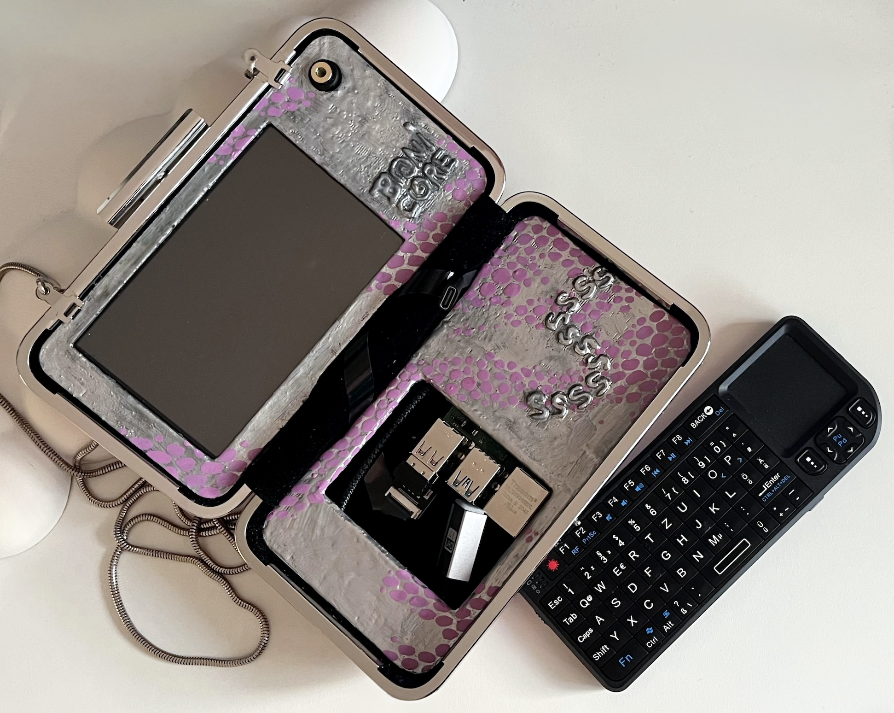<p><em>The finished Cute Cyberdeck open</em></p></div>

## Abstract

This project builds a small personal computer into a pink faux snakeskin clutch bag. The idea came from a growing online community of FLINTA, queer creators and allies who started building custom computers into vintage handbags and thrifted cases in early 2026. Where most consumer electronics are sealed, proprietary devices that hide their own inner workings and actively resist repair, these builders reclaim that knowledge by constructing their own machines from scratch. This project is part of that conversation. The computer runs on a Raspberry Pi 4 and includes a 5 inch touchscreen display, a wireless keyboard, and custom 3D-printed mounts. It is also loosely connected to an academic paper written in the same semester that examines why cuteness works as a way of making tech spaces feel more accessible. The build is presented as a functional prototype and a milestone of an ongoing personal project.

## Concept

The hyperfeminine cyberdeck community felt immediately relevant to me, not just as a research subject but as a space I wanted to actively be part of. Building my own cyberdeck was a way of joining that conversation through making rather than just writing about it. This was also my first physical computing project, which made it both a technical challenge and a personal milestone.

The vision behind this build is practical as much as it is aesthetic. As a DJ who co-organizes parties with my collective, one recurring gap has always been visuals. Good visuals are hard to come by, and bringing your own setup is often complicated. A fully functional computer built into a clutch bag that can connect to a beamer and run audio-reactive visuals on site felt like a solution that is also a statement. A computer in a handbag is, simply put, very badass.

<div align="center">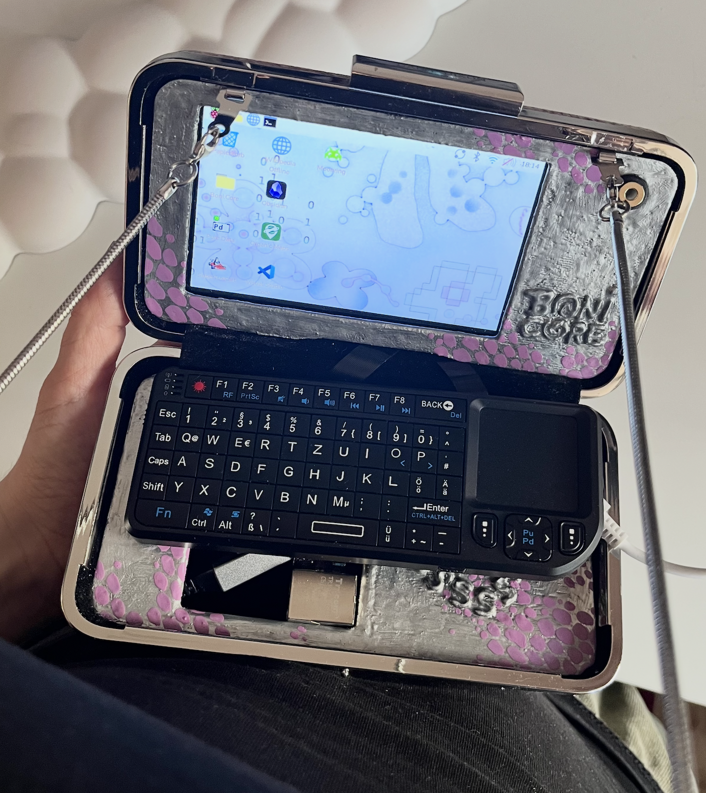<p><em>Wearing and looking down on the cyberdeck</em></p></div>

The project sits at the intersection of maker culture, DJ and party culture, and Cute Studies. The clutch is not just an enclosure. It is the concept.

## Implementation

The build centers around a Raspberry Pi 4 Model B running Raspberry Pi OS (64-bit), housed inside a Daisy Dixon faux snakeskin clutch bag, sourced secondhand from someone who only wanted the watch it came with.

<div align="center">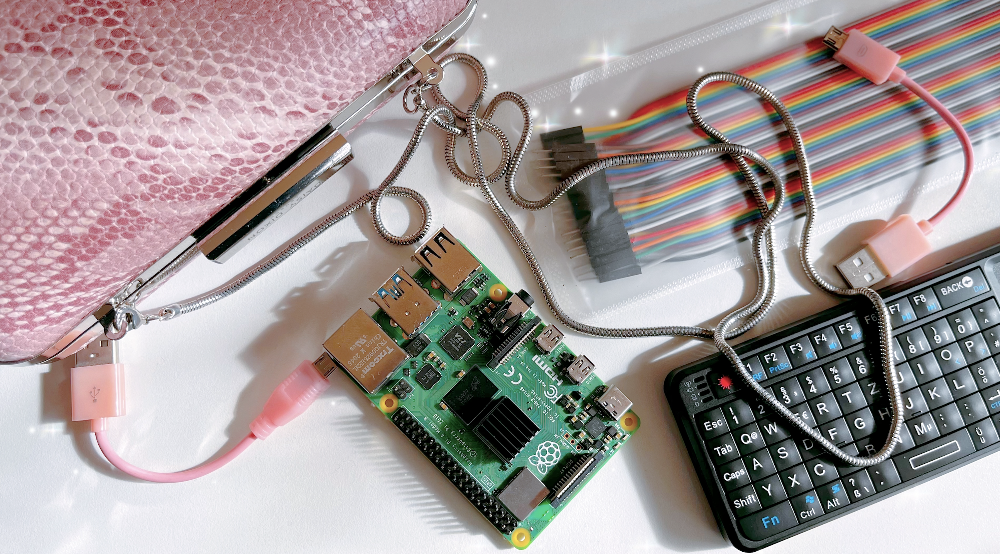<p><em>Hardware components</em></p></div>

The display is a Waveshare 5 inch capacitive touchscreen (800x480) connected via a short Micro-HDMI to HDMI ribbon cable, which was a genuine gamechanger for the build: standard cables are too bulky to fit cleanly inside a clutch, and finding flat ribbon cables in the right connector format made the entire assembly significantly more compact and manageable. Touch input is connected via a short USB ribbon cable. Input is handled by a mini wireless keyboard with integrated touchpad via a USB dongle. Two custom mounts, one for the display and one for the Raspberry Pi, hold the parts in place inside the clutch. I designed them in Blender and had them 3D printed.

<div align="center">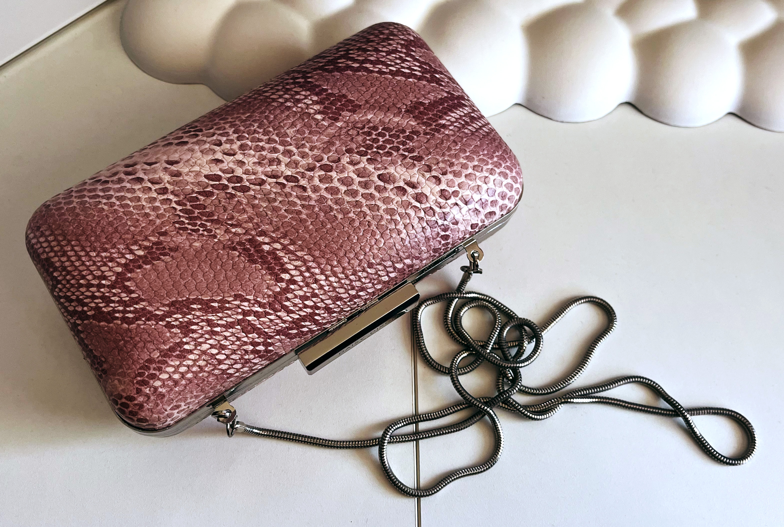<p><em>The clutch closed </em></p></div>

<div align="center">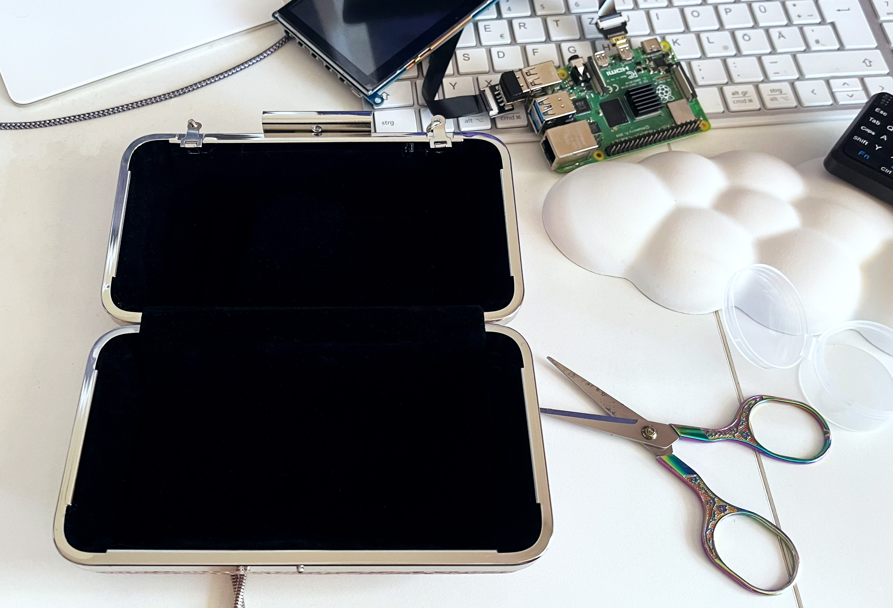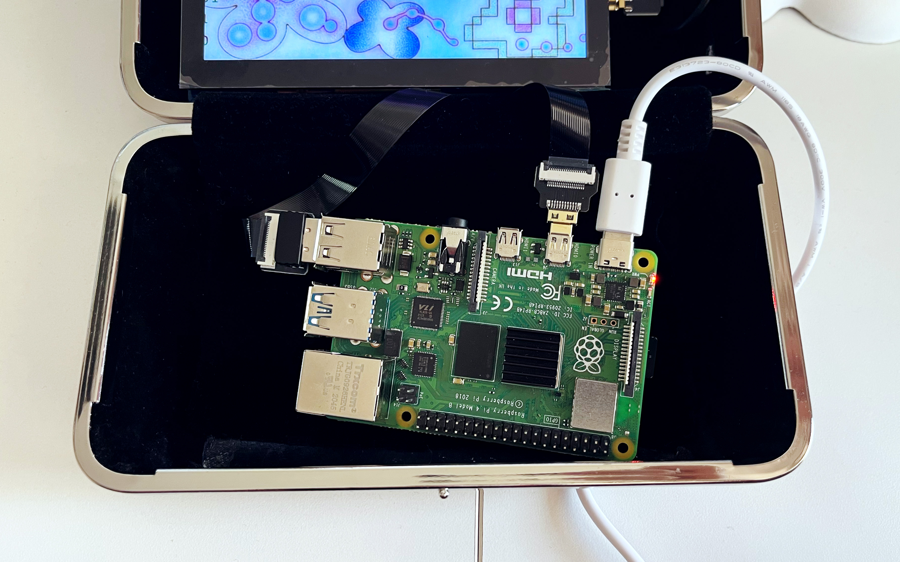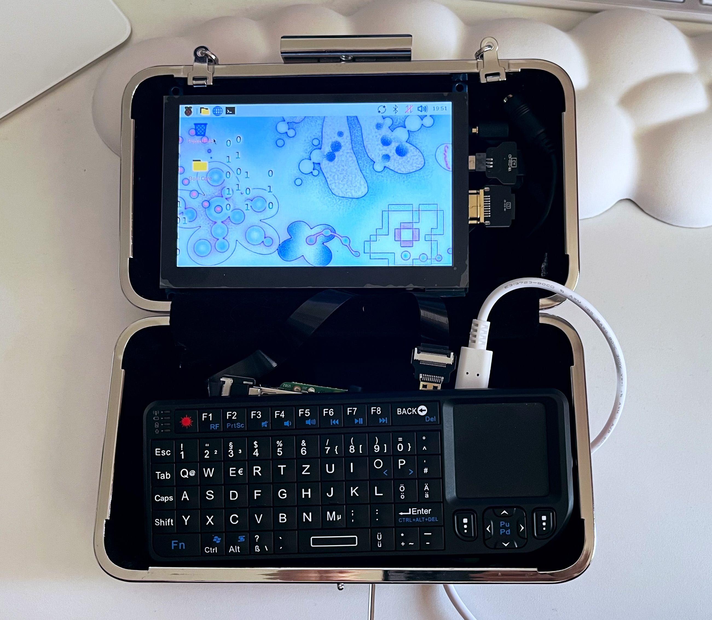<p><em>Assembly process: preparing the clutch, mounting the Pi, and installing the ribbon cables</em></p></div>

<div align="center">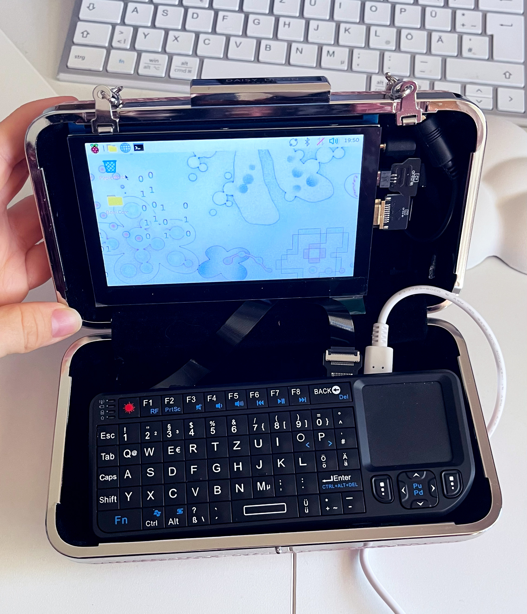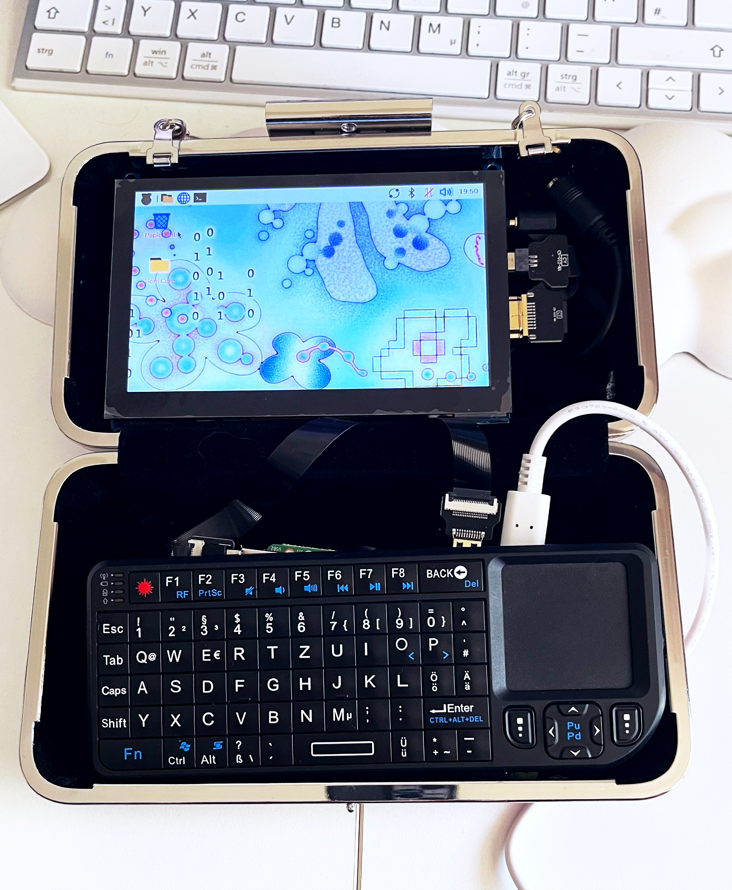<p><em>The components installed in the clutch</em></p></div>

### System overview

```
Keyboard (USB dongle) ───► ┌────────────────┐ ──HDMI 0, ribbon cable──► ┌──────────────────┐
                           │ Raspberry Pi 4 │                           │ Waveshare 5 inch │ ──► headphone jack
USB-C power ─────────────► │                │ ◄──USB touch, ribbon───── │   touchscreen    │     (3.5 mm extension)
                           └────────────────┘                           └──────────────────┘
                                   │
                                   └──HDMI 1──► beamer (prepared)
```

The software setup includes VS Code for coding, Obsidian for note-taking, Pure Data for audio work, Git and GitHub for version control, and Chromium as the main browser. Installing openFrameworks turned out to be a major debugging problem, so I had to put it off until later.

<div align="center">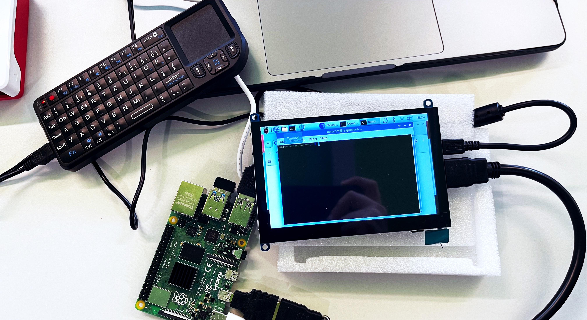<p><em>Software running on the Pi</em></p></div>

Beyond the basics, I added a few offline tools that fit the idea of a cyberdeck. Kiwix serves an offline copy of Simple English Wikipedia, and Organic Maps provides offline maps. Wikipedia runs as a background service, so it is ready after every start.  SuperTuxKart is also installed, because why not. Every program has its own icon on the desktop, so nothing has to be opened through the terminal. For fun, the free retro RPG Moonring runs through Box64, a tool that lets x86 programs run on the ARM processor of the Pi. I also tried Stellarium for offline star maps, but its interface did not work properly on the Pi, so I removed it again.

<div align="center"><p><em>Offline Wikipedia search (left) and a quick round of Moonring (right), both running on the Pi</em></p></div>

## Results

The build started with a lot of research and planning: figuring out what the cyberdeck should be able to do, finding the smallest and cheapest version of every part, and comparing options before buying. This preparation phase took up a big part of the total project time, especially after the Pi Zero 2 W turned out to be unavailable and the plan had to shift to a Pi 4.

The final hardware setup has a Raspberry Pi 4 fully built into the faux snakeskin clutch. The Waveshare 5 inch touchscreen is connected using flat ribbon cables for both HDMI and USB touch input, which made it possible to fit everything into the small bag. A mini wireless keyboard with a touchpad handles input, and a 3.5mm audio extension gives access to the headphone jack. A second HDMI output is set up so the deck can connect to a beamer.

On the software side, Raspberry Pi OS (64-bit) runs VS Code, GitHub (via SSH), Obsidian, Pure Data, Chromium, offline Wikipedia (Kiwix), Organic Maps and the retro RPG Moonring. Installing openFrameworks was attempted but did not work in the end, due to compatibility issues between the current Raspberry Pi OS version (Debian Trixie) and the build tools. This remains an open task for later.

The custom mounts were designed in Blender with exact millimeter measurements to fit the display, the Raspberry Pi and the inside of the clutch. The screen mount has a small extruded name tag, and the Pi mount has a repeating "ssss" pattern in a snake-like formation, referencing the clutch's snakeskin texture.

<div align="center">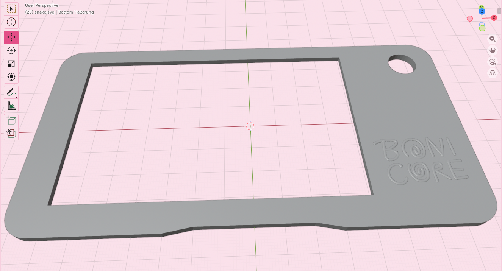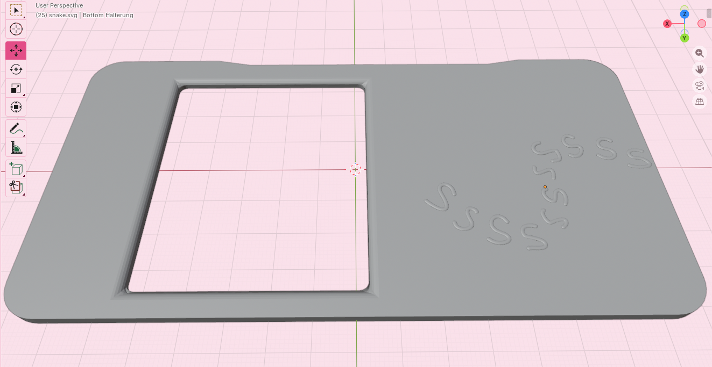<p><em>Custom mounts designed in Blender: the screen mount (left) and the Pi mount (right), with the snakeskin-inspired "ssss" pattern</em></p></div>

After printing, the small letters did not come out well, so I rebuilt them by hand with modeling gel. The cooling and ventilation of the Raspberry Pi is also not optimal yet: inside the closed clutch there is almost no airflow, so the Pi heats up quickly during longer use. I then cured the gel under a UV lamp and finished the printed parts with chrome gel nail polish, which matches the metal parts of the clutch. While waiting for the print, I also prepared an acrylic version as a backup, cut and sanded by hand with a saw and a rotary tool with sanding attachments.

<div align="center">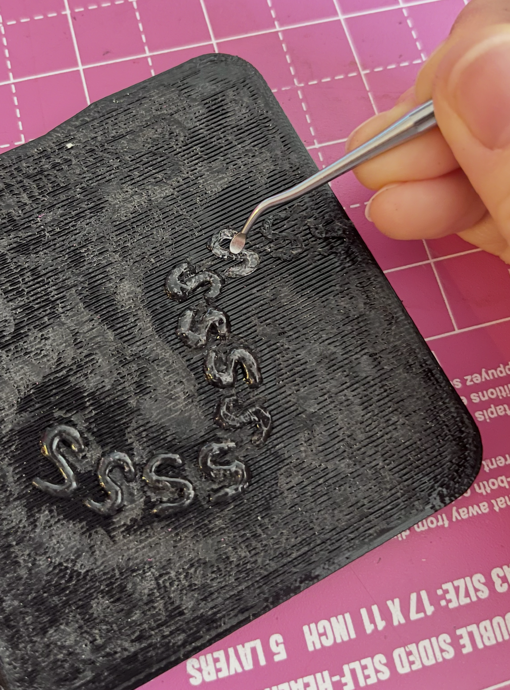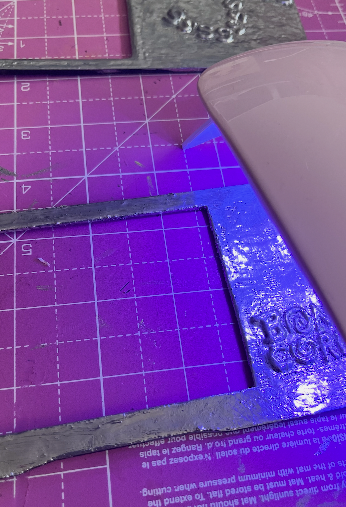<p><em>Rebuilding the letters with modeling gel (left) and curing the printed part under UV light (right)</em></p></div>

<div align="center">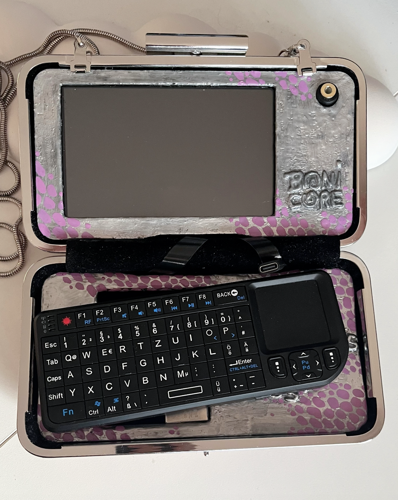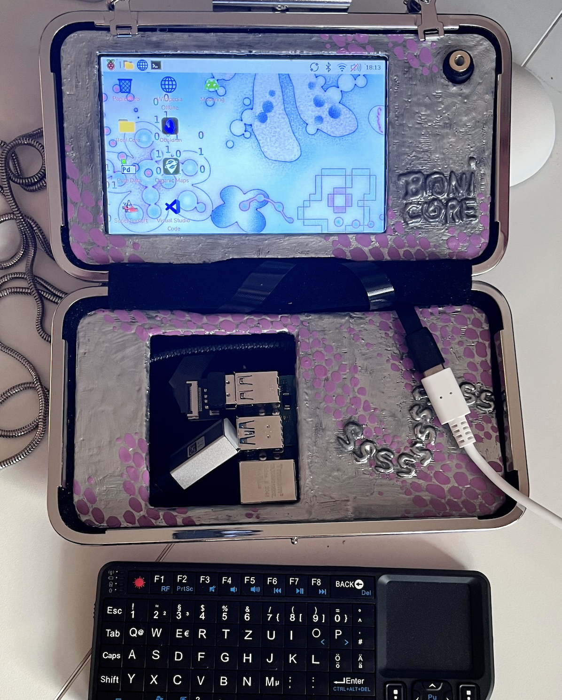<p><em>The finished cyberdeck</em></p></div>

## Project Reflection & Discussion

One of the biggest challenges of this project had nothing to do with building: it was finding the right hardware. The original plan was to use a Raspberry Pi Zero 2 W, which would have been significantly smaller and more suitable for the clutch enclosure. However, the Pi Zero 2 W has been out of stock everywhere for months. The few units available on eBay were listed at auction prices of 60 euros and above, compared to a retail price of around 18 euros, which made purchasing one unreasonable. After three months of checking stock trackers and waiting, the decision was made to use a Raspberry Pi 4 as a stand-in. This works well as a development platform and allows the project to be fully functional and documented by the deadline. Switching to the Pi Zero 2 W remains a planned next step once stock normalizes.

This was my first large solo project involving hardware and physical computing, which made almost every step a genuine challenge. Throughout the process, I regularly watched videos from other creators in the community for guidance, especially from Ube Boobey, whose TikToks often showed alternative ways of solving a problem I was stuck on. For deeper technical questions, particularly around hardware and the Linux command line, which was completely new territory for me, I relied heavily on Claude to explain concepts and debug issues step by step.

Several things worked well. The flat ribbon cables made the build small enough for the clutch, the offline tools are now easy to open from the desktop, and I was able to design the mounts myself in Blender. Other things did not work. The most frustrating part was trying to get openFrameworks running on the Raspberry Pi. After two full days of debugging architecture and build tool incompatibilities, I had to put it on hold for now. Stellarium did not work properly either, so I removed it. The fine letters on the 3D print also did not come out cleanly, which I fixed by hand with modeling gel.

This project sits directly within the context of Cute Studies, maker culture, and the accompanying academic paper on cuteness as a mechanism of access. Beyond the technical build, my goal is to become part of that ongoing discussion: around closed, proprietary hardware, and around the ways that a soft, cute aesthetic can carry an underestimated form of rebellion. I am genuinely looking forward to the conversations this project will spark once I start bringing the clutch to real places, for example running visuals off it at a party.

Future work includes getting openFrameworks running on the Pi, and switching from the Raspberry Pi 4 to a Pi Zero 2 W once it becomes available again. This would finally allow the battery and charging setup to be installed, making the cyberdeck fully wireless and usable without being plugged in. Another next step is a better cooling solution, for example heat sinks, ventilation holes in the mounts and the clutch, or a small fan. The Pi Zero 2 W would also produce much less heat than the Pi 4. Another next step is audio-reactive visuals for parties. The Pi has no audio input, so a small USB audio adapter would be needed to connect it to a mixer.

## Lessons Learned

The most important thing I take away from this project is the skill set itself: I now have a real, hands-on understanding of what it takes to build something like this from scratch. Even more important, I lost the fear of touching hardware. I feel comfortable tinkering now, and in a way, I feel like I have genuinely become part of maker culture.

A lot of the technical learning happened through small, specific fixes along the way, from correctly applying scale in Blender to debugging Linux dependency errors. Each of these felt minor in isolation, but together they added up to a much better understanding of how hardware and software actually work together.

Time-wise, I held onto the hope of getting a Pi Zero 2 W for a bit too long, which put some pressure on the final stretch. But I don't think this counts as a lesson about buffer time so much as something that just happened along the way. A cyberdeck is never really finished; there is always something to optimize or customize further. That ongoing, evolving nature is part of what the format is about in the first place.

## Working Hours

| Date | Task | Hours |
|---|---|---|
| 08/07/2026 | Setting up the project | 2 |
| 04/08/2026 | Raspberry Pi introduction | 3 |
| 12/09/2026 | Planning and implementing | 5 |
| 15/09/2026 | openFrameworks debugging | 5 |
| 20/09/2026 | Assembling the cyberdeck with new cables, designing the mounts in 3D, placing the print order | 12 |
| 25/09/2026 | Installing offline tools on the Raspberry Pi | 8 |
| 26/09/2026 | Measuring, sawing and sanding the acrylic backup | 3.75 |
| 28/09/2026 | Finishing the 3D printed mounts with gel nail polish | 6 |
| **Total** | | **44.75** |

Working hours were tracked in Notion. Some smaller sessions, such as research and ordering parts, were not tracked, so the real total is a bit higher.

## Acknowledgements

I wrote the content of this documentation myself. Claude (Anthropic) helped me with drafting, grammar and technical troubleshooting during the build.